# PixelEditor <!-- omit in toc -->
Pixel Image Editor for Minecraft

このツールは、平面上のMinecraftのブロック配置を
デザインするためのツールです。

マインクラフト・ワールド上にバーチャル秋葉原を建設するにあたり、
ビル壁面のデザインを簡単にするために開発されました。

- [主な機能](#主な機能)
- [基本的な使い方](#基本的な使い方)
  - [ボタンの機能](#ボタンの機能)
    - [セレクトモード](#セレクトモード)
    - [パン・モード](#パンモード)
    - [ペイントモード](#ペイントモード)
    - [長方形塗りモード](#長方形塗りモード)
    - [消去モード](#消去モード)
    - [スポイドモード](#スポイドモード)
    - [ブロック・ボタン](#ブロックボタン)
    - [画像ボタン](#画像ボタン)
- [データの保存](#データの保存)
- [背景画像を使う](#背景画像を使う)
  - [背景画像の読込み](#背景画像の読込み)
  - [遠近法ワープ](#遠近法ワープ)
- [変更履歴](#変更履歴)
  - [v1.0.0](#v100)

# 主な機能

* 平面上にMinecraftのブロックを配置できます。
(全てのブロックを配置できるわけではありません。
各色のテラコッタ、羊毛、コンクリート、ガラスなどが用意されています)
* 画像を読込み、遠近法ワープ(変形)を行い下絵として表示できます。
* 背景画像を元に近い色のブロックを自動配置できます
* 配置したブロックの集計表(種類ごとの数)を表示、印刷できます。

# 基本的な使い方 

PixelEditorはブラウザで以下のサイトにアクセスするだけで
使用することができます。

https://h-nari.github.io/PixelEditor/

アクセスすると、次の画面が現れます。

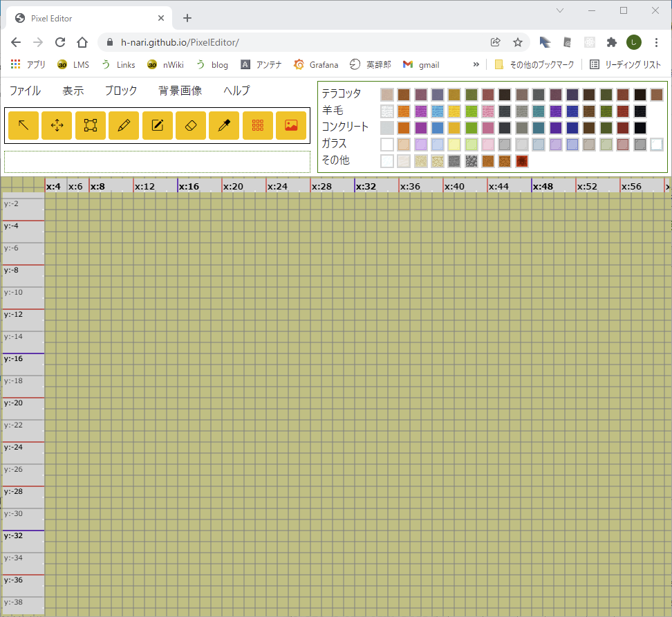

## ボタンの機能

### セレクトモード

このボタンを押すとセレクトモードになります。
マウスのドラッグで
矩形領域の選択ができます。
領域のサイズがメッセージ・エリアに表示されるので
サイズの計測にも利用できます。

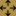

### パン・モード

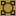
マウスのドラッグで表示領域を動かすことができます。

### ペイントモード
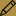 
クリック・ドラッグで選択されたブロックがカーソル位置に塗られます。

### 長方形塗りモード

ドラッグした矩形領域に選択されたブロックが塗られます。
長方形や、水平線、垂直線を書きたい場合に便利です。

### 消去モード

クリック・ドラッグでカーソル位置のブロックを消去します。

### スポイドモード

マウス・クリックでカーソル位置にブロックされていれば
そのブロックが選択された状態になり、他の位置に塗ることができます。
カーソル位置にブロックがなければ消去モードになります。

### ブロック・ボタン

クリックすることでブロック全体の表示・非表示を切り替えます。

### 画像ボタン

クリックすることで背景画像の表示・非表示を切り替えます。

# データの保存

描画したブロックの配置、読み込んだ背景画像などの情報は
ブラウザのlocalStrageに保存されます。
このため、おなじブラウザでアクセスすると、以前の編集結果が
残っていますが、他のPCや他のブラウザからアクセスすると
以前の編集結果は見ることができません。

このデータはメニューの「ファイル・保存」でPCのファイルに保存できます。
保存したファイルは「ファイル・開く」で読み込むことができます。
「ファイル・クリア」でブラウザに保存されたデータを消去できます。

# 背景画像を使う

## 背景画像の読込み

まず対象となるビルの写真を入手します。
今回は、フリー素材のビルの写真に
秋葉原のビルのものがあったのでこれを使用しますが、
Google Street Viewや Google Map 3Dの画像が
入手しやすいです。

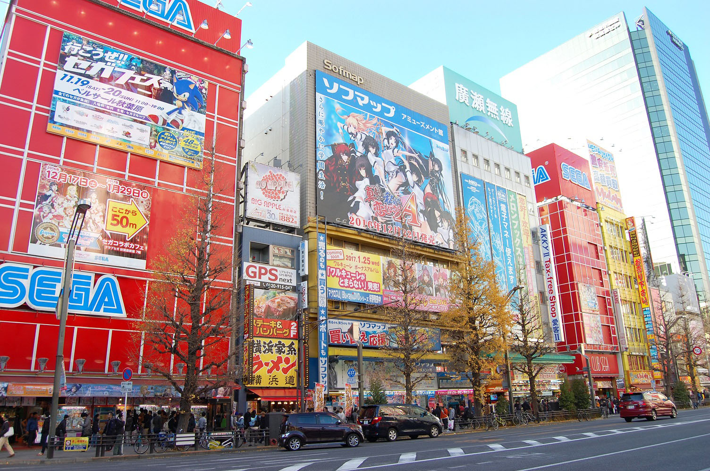

この画像を
メニューの「背景画像/背景画像読込」で読み込みます。

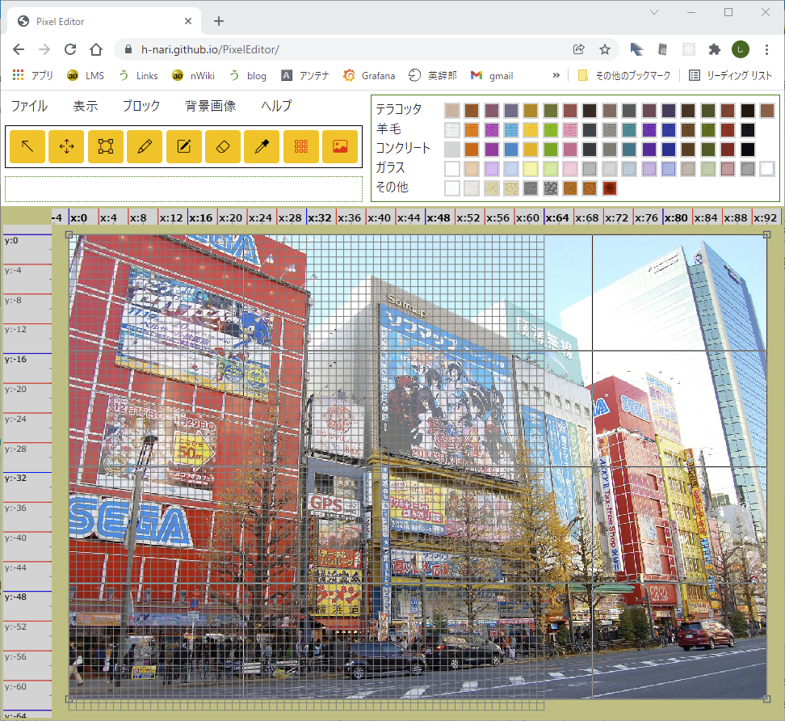

ブロックの枠が表示されていて見にくいので、

ボタンをクリックしブロックを非表示にします。

## 遠近法ワープ

斜めからの画像では下絵として使用しにくいので
正面からの画像に変換します。
画像の外周に表示されているフレームの頂点の小さい正方形を
ドラッグし、モデル化したいビルの四隅に正確に合わせます。

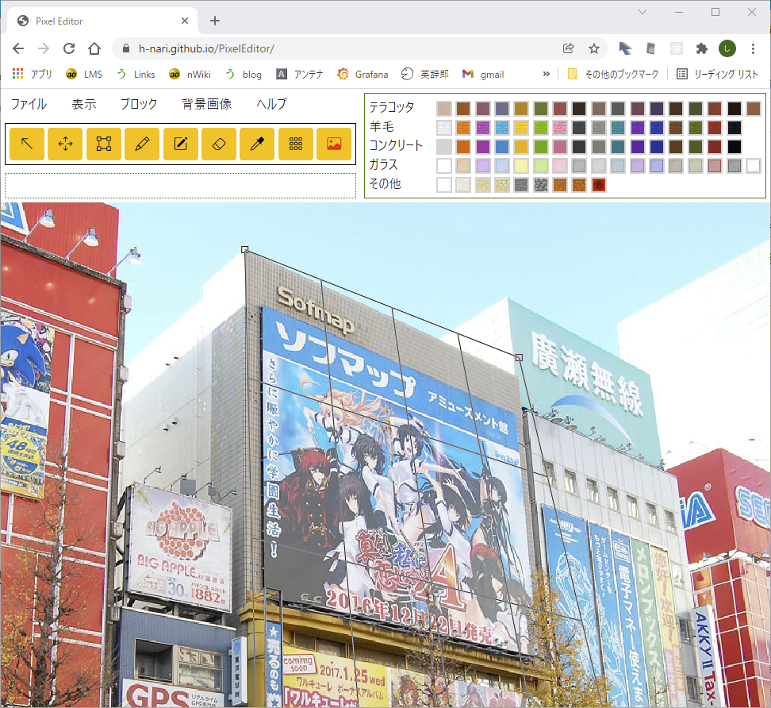

画像はマウスのホイールで拡大縮小できますので、
細かく位置を調整できます。

次にビルの高さと横幅を決めます。
ビルの高さは <a href="https://plateauview.jp/">plateauview.jp</a>
から取得可能です。

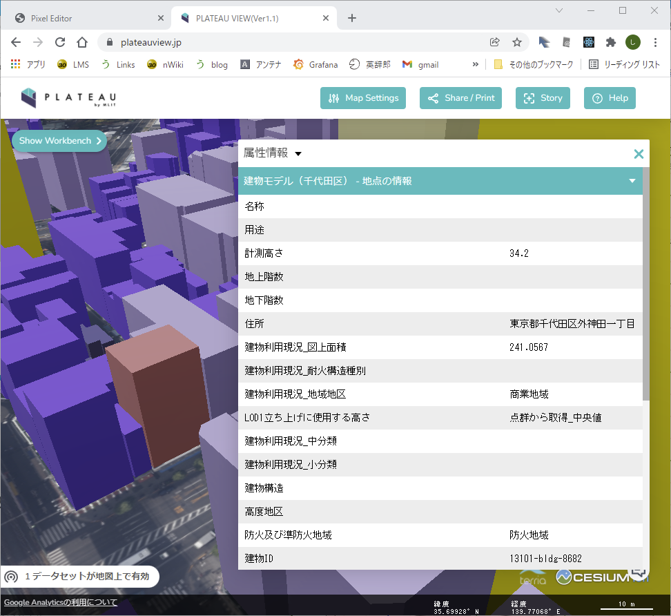

このビルでは 34.2mとなっていますが、
plateauviewのデータは航空測量による点群の中央値と
ありますので、参考程度にとどめ、他のビルとの
関係などから決定しましょう。
ここでは34mとします。

Google Map 3Dの画像

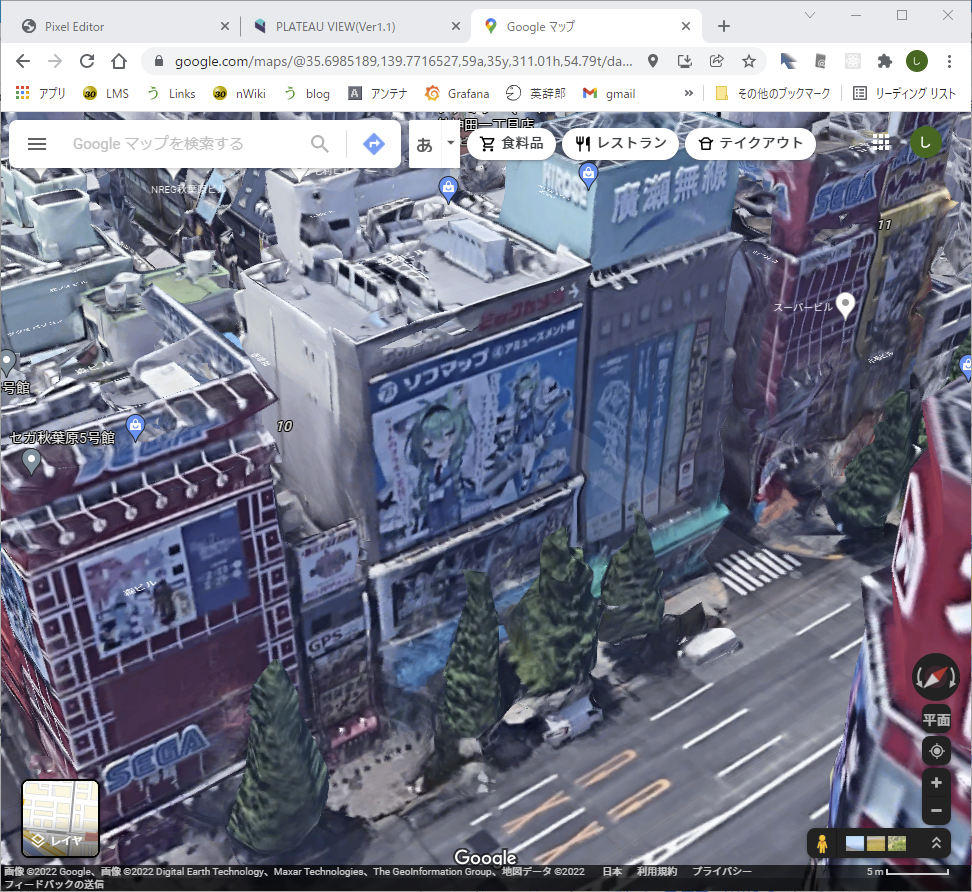

ビルの幅は、Chizucraftから取得可能です。
ビルの壁面は多くの場合マインクラフトのX軸、Z軸に対して
斜めになっています。
マインクラフトでブロックを配置することを考えると
近い方の軸に平行な平面とみなしたほうが
作業しやすいので、
このビルの場合、壁面は Z=1018から1034までありますので
Zの幅で17ｍとします。

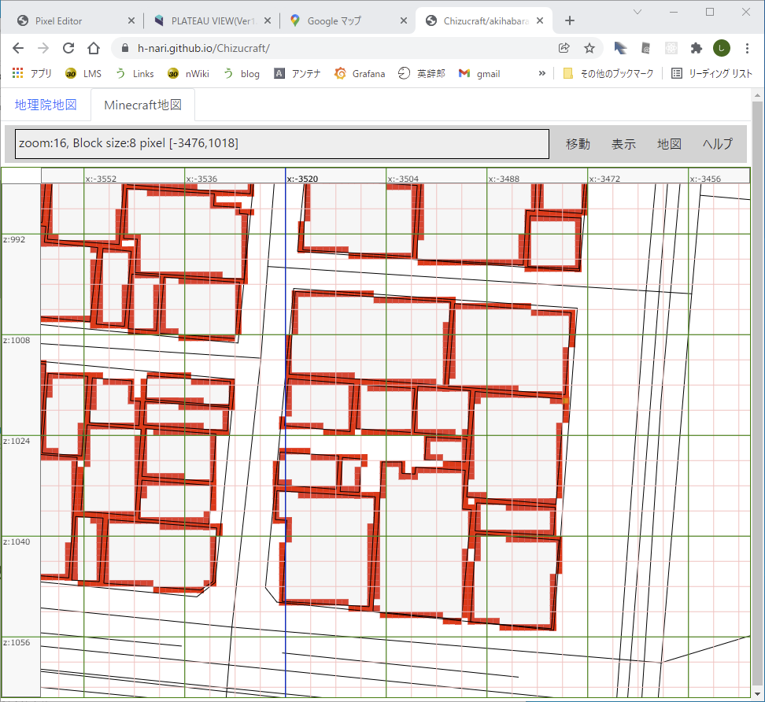

メニューから「背景画像/遠近法ワープ」を選択肢
幅 17, 高さ 34を入力し「ブロック領域を新規作成」を
クリックします。

すると次のような画面が表示されます。
画像の一部しか表示されていない場合は
メニューの「表示/全体表示」で全体を表示できます。

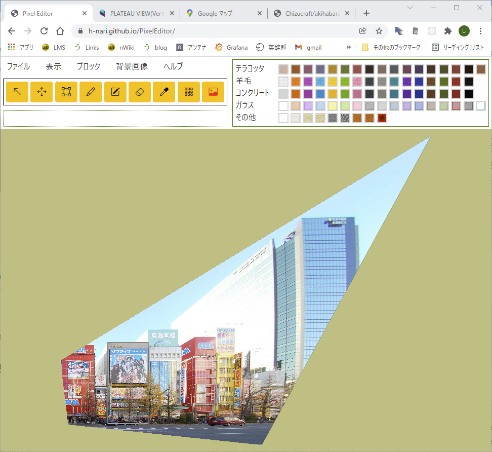

「背景画像/フレーム内画像のみ表示」を選択すると、
対象領域の画像のみ表示され見やすくなります。

あとは

ボタンをクリックしブロックを表示
ブロックを塗って行きます。

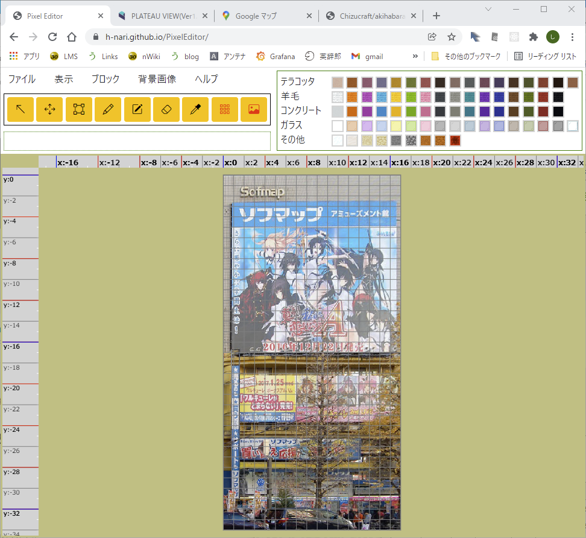

# 変更履歴

## v1.0.0

* 2022/02/03(Thu) リリース
* 初版

