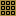

# PixelEditor
Pixel Image Editor for Minecraft

このツールは、平面上のMinecraftのブロック配置を
デザインするためのツールです。

マインクラフト・ワールド上にバーチャル秋葉原を建設するにあたり、
ビル壁面のデザインを簡単にするために開発されました。

## 主な機能

* 平面上にMinecraftのブロックを配置できます。
(全てのブロックを配置できるわけではありません。
各色のテラコッタ、羊毛、コンクリート、ガラスなどが用意されています)
* 画像を読込み、遠近法ワープ(変形)を行い下絵として表示できます。
* 配置したブロックの集計表(種類ごとの数)を表示、印刷できます。

## 基本的な使い方 

### 背景画像の読込み

### 遠近法ワープ

## 画面の説明

### ボタン

 

## メニュー

## 変更履歴

### v1.0.0

* 初版

